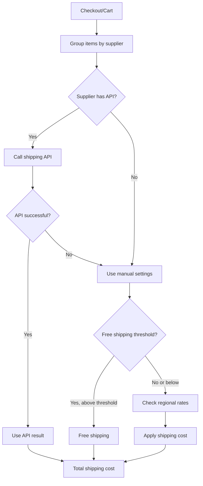

# Systém správy dodavatelů - Shipping & Return Policies

## Přehled

Implementoval jsem flexibilní systém pro správu dodavatelů, který umožňuje každému dodavateli nastavit vlastní:
- Ceny dopravy (API nebo manuální)
- Free shipping prahy
- Return policies (podmínky vrácení)
- Regionální cenové sazby

## ✨ Nové funkce

### 1. Admin rozhraní pro dodavatele (`/admin/suppliers`)
- **Přehled všech dodavatelů** s jejich shipping nastavením
- **Detail stránka** pro konfiguraci každého dodavatele
- **Přepínání stavu** (aktivní/neaktivní)

### 2. Konfigurovatelné shipping nastavení
- **API integrace**: Dodavatel může mít vlastní API pro real-time shipping costs
- **Manuální nastavení**: Fixní ceny, regionální sazby, free shipping prahy
- **Fallback mechanismus**: Pokud API selže, použije se manuální nastavení

### 3. Return policies pro každého dodavatele
- **Počet dní** na vrácení (standardně 14)
- **Kdo platí** return shipping (zákazník/dodavatel/sdílené)
- **Podmínky vrácení** (volný text)
- **Adresa pro vrácení**
- **Instrukce** pro zákazníky

## 🗄️ Databázové změny

### Rozšíření `suppliers` tabulky

```sql
-- Shipping nastavení
shipping_api_endpoint    STRING?     -- API pro real-time shipping costs
shipping_api_key         STRING?     -- API klíč pro shipping API
has_shipping_api         BOOLEAN     -- Má API pro shipping?

-- Manuální shipping nastavení
shipping_flat_rate       FLOAT?      -- Fixní poplatek za dopravu
shipping_free_threshold  FLOAT?      -- Částka pro free shipping
shipping_regions         JSON?       -- Regions s různými cenami
shipping_rules           JSON?       -- Komplexní pravidla dopravy

-- Return Policy nastavení
return_policy_days       INT?        -- Počet dní na vrácení (default 14)
return_policy_conditions STRING?     -- Podmínky vrácení (text)
return_policy_cost       STRING?     -- Kdo platí return shipping
return_address           STRING?     -- Adresa pro vrácení zboží
return_instructions      STRING?     -- Instrukce pro vrácení

-- Další nastavení
currency                 STRING      -- Měna dodavatele (default EUR)
vat_included             BOOLEAN     -- Jsou ceny včetně DPH?
```

## 🔧 API endpointy

### Admin API
- `GET /api/admin/suppliers` - Seznam všech dodavatelů
- `GET /api/admin/suppliers/[id]` - Detail dodavatele
- `PATCH /api/admin/suppliers/[id]/settings` - Aktualizace nastavení
- `PATCH /api/admin/suppliers/[id]/status` - Změna stavu (aktivní/neaktivní)

### Shipping kalkulace
- `POST /api/shipping/calculate` - Kalkulace shipping costs pro frontend

### Checkout API (upraveno)
- Automaticky používá nastavení dodavatele místo fixních hodnot
- Podporuje více dodavatelů v jedné objednávce

## 🚀 Jak to funguje

### 1. Kalkulace shipping costs



### 2. Priorita shipping nastavení

1. **API call** (pokud je nastaveno a funkční)
2. **Free shipping threshold** (pokud je subtotal nad límitem)
3. **Regionální sazby** (podle země zákazníka)
4. **Fixní sazba** (supplier flat rate)
5. **Fallback** (€4.99 + distanční poplatek)

### 3. Przykład regionálních sazeb (JSON)

```json
{
  "CZ": 5.99,
  "SK": 6.99,
  "EU": 9.99,
  "WORLD": 19.99
}
```

## 📋 Návod na použití

### 1. Přidání dodavatele do systému

Dodavatelé se vytváří automaticky když partneři přidají produkty. Pro konfiguraci shipping:

1. Jdi na `/admin/suppliers`
2. Najdi dodavatele
3. Klikni "⚙️ Nastavení"

### 2. Konfigurace shipping

#### Option A: API integrace
```
✅ Dodavatel má vlastní API pro ceny dopravy
API Endpoint: https://api.supplier.com/shipping/calculate
API Key: sk_live_...
```

#### Option B: Manuální nastavení
```
❌ Dodavatel má vlastní API pro ceny dopravy

Fixní poplatek za dopravu: 5.99 EUR
Free shipping nad: 50.00 EUR

Ceny podle regionů:
{
  "CZ": 5.99,
  "SK": 6.99,
  "EU": 9.99,
  "WORLD": 19.99
}
```

### 3. Return policies

```
Počet dní na vrácení: 14
Kdo platí return shipping: Zákazník

Podmínky vrácení:
"Zboží lze vrátit do 14 dní v původním stavu s visačkami. 
Spodní prádlo a plavky nelze vrátit z hygienických důvodů."

Adresa pro vrácení:
"Fashion Store s.r.o.
Václavské náměstí 1
110 00 Praha 1
Česká republika"

Instrukce pro vrácení:
"1. Zabalte zboží do původního obalu
2. Přiložte kopii faktury
3. Odešlete na uvedenou adresu"
```

## 🔍 Frontend integrace

### Shipping calculator pro kampagne

```javascript
// Kalkulace shipping costs před checkout
const response = await fetch('/api/shipping/calculate', {
  method: 'POST',
  headers: { 'Content-Type': 'application/json' },
  body: JSON.stringify({
    items: [
      { productId: 'prod_123', quantity: 2 }
    ],
    country: 'CZ'
  })
})

const { shipping } = await response.json()
console.log(`Total shipping: €${shipping.totalCost}`)
console.log('Free shipping offers:', shipping.freeShippingOffers)
```

### Zobrazení return policies

```javascript
// Na product detail page
const supplier = product.supplier
if (supplier.return_policy_conditions) {
  showReturnPolicy({
    days: supplier.return_policy_days,
    conditions: supplier.return_policy_conditions,
    cost: supplier.return_policy_cost
  })
}
```

## 🛠️ Development setup

### 1. Spuštění migrace

```bash
cd goozy-platform
npx prisma migrate dev --name add_supplier_shipping_return_settings
```

### 2. Test API endpointů

```bash
# Test shipping kalkulace
curl -X POST http://localhost:3000/api/shipping/calculate \
  -H "Content-Type: application/json" \
  -d '{
    "items": [{"productId": "prod_123", "quantity": 1}],
    "country": "CZ"
  }'

# Test admin suppliers
curl http://localhost:3000/api/admin/suppliers
```

## 📊 Monitoring & Analytics

### Shipping performance metriky

- **API response times** pro supplier shipping APIs
- **Fallback rate** (jak často API selže)
- **Free shipping utilization** (kolik zákazníků dosáhne free shipping)
- **Average shipping cost** per supplier

### Return rates tracking

- **Return rate** per supplier
- **Most common return reasons**
- **Return shipping costs** analysis

## 🔐 Bezpečnost

### API klíče
- Shipping API klíče jsou uloženy zašifrované v databázi
- Nikdy se nezobrazují v plném znění v admin UI
- Log rotation pro API call logy (3 měsíce retention)

### Rate limiting
- Shipping API calls: max 60 requests/minute per supplier
- Admin endpoints: standardní rate limiting
- Webhook validace pro supplier API callbacks

## 🎯 Budoucí rozšíření

### V1.1
- **Batch shipping updates** pro rychlejší synchronizaci
- **Shipping insurance** options per supplier
- **Express delivery** support

### V1.2
- **Multi-language return policies**
- **Automated return labels** generation
- **Shipping tracking** integration

### V1.3
- **AI-powered shipping optimization**
- **Dynamic pricing** based on demand
- **Carbon footprint** tracking per shipment

---

## 🆘 Troubleshooting

### Common issues

**Q: Shipping API nefunguje**
A: Zkontroluj endpoint URL a API key v admin. Systém automaticky přepne na manuální nastavení.

**Q: Free shipping se neaplikuje**
A: Ověř že supplier má nastaven `shipping_free_threshold` a subtotal je skutečně nad hranicí.

**Q: Nesprávné regionální ceny**
A: Zkontroluj JSON formát v `shipping_regions`. Musí být validní JSON s ISO country codes.

**Q: Return policy se nezobrazuje**
A: Ověř že supplier má vyplněné `return_policy_conditions` a `return_policy_days`.

### Logy

Shipping kalkulace loguje do console s prefixem `🚚 [SHIPPING]`:
- Supplier processing
- API calls a responses
- Fallback reasons
- Final costs

Admin operace logují s prefixem `⚙️ [ADMIN-SUPPLIERS]`:
- Settings updates
- Status changes
- Validation errors 